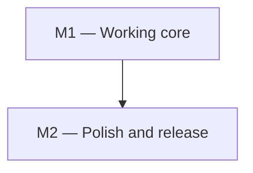

<!--
File: docs/GITHUB_PROJECT.md

This is a small WORKED EXAMPLE.  Replace its content with your own
project plan and keep the structure: it is what the scripts parse.

This file is partially generated by scripts/gh_project_update.py.
Manual prose (everything outside the marked regions: summary, milestone
descriptions, exit criteria, dependency graphs) is hand-edited.  Issue
listings between

    BEGIN GENERATED: milestone-N
    ...
    END GENERATED: milestone-N

markers are regenerated from GitHub state by `make update`; edits to
those regions will be overwritten on the next update.  Structure lives
here; state (issue numbers, open/closed, assignees) lives on GitHub.
-->

# Example — GitHub Project Roadmap

**Project Title**:  Timeline — a small command-line time tracker

**Repository**:  `your-github-user/your-repo`

---

## Summary

Build a tiny command-line time tracker in two milestones: a working core
(start/stop/report on local JSON storage), then polish (colored output,
shell completion, a published release).  The example is deliberately
small — two milestones, four issues — so that every construct the
tooling understands appears here exactly once.

---

## Labels

The `milestone-N-*` labels are load-bearing: populate attaches them, and
update uses them to decide which generated region an issue belongs to
(they survive milestone renames, unlike the milestone title).  The other
labels are ordinary topic labels; add your own.

- `milestone-1-core` (0075ca) — Milestone 1: Working core.
- `milestone-2-polish` (5319e7) — Milestone 2: Polish and release.
- `documentation` (0e8a16) — Documentation changes.
- `good first issue` (7057ff) — Small and self-contained.

---

## Milestones

### Milestone 1 — Working core

**Description:**

Stand up the smallest useful tool: `timeline start <task>`,
`timeline stop`, and `timeline report` over a local JSON file.  No
configuration, no dependencies beyond the standard library.

**Exit criterion:**

A fresh checkout runs `timeline start x && timeline stop && timeline
report` and prints one correctly-summed entry; CI runs the test suite on
every pull request.

---

### Milestone 2 — Polish and release

**Description:**

Make it pleasant: colored report output, shell completion, and a tagged
v1.0 release with install instructions.

**Exit criterion:**

`pipx install` from the tagged release works on a clean machine and
`timeline report` output is readable at a glance.

---

### Milestone dependencies

Hand-authored (machine generation would require a dependency convention
nobody has committed to); update never touches it.

---

## Issues

Each issue below carries its milestone, labels, and a body ready for
GitHub.  On first populate, the `[MN-k]` ID in each heading becomes a
`[MN-k]` title prefix on GitHub — the join key that keeps re-runs
idempotent — and the new issue number is written back into the heading
as a `(#N)` suffix.

## Milestone 1 — Working core

<!-- BEGIN GENERATED: milestone-1 -->

### Issue M1-1: Storage layer — append-only JSON event log

**Labels:** `milestone-1-core`
**Milestone:** 1. Working core

Design and implement the on-disk format: one JSON object per line
(`{"task": ..., "start": ..., "stop": ...}`), appended atomically.

Acceptance criteria:

- concurrent `start` invocations cannot corrupt the file
- a malformed trailing line (crash artifact) is detected and reported

---

### Issue M1-2: CLI commands — start, stop, report

**Labels:** `milestone-1-core`
**Milestone:** 1. Working core

`start <task>` opens an interval, `stop` closes the open interval,
`report` sums per-task durations for today.  Refuse to `start` twice
without an intervening `stop`.

---

<!-- END GENERATED: milestone-1 -->

## Milestone 2 — Polish and release

<!-- BEGIN GENERATED: milestone-2 -->

### Issue M2-1: Colored, aligned report output

**Labels:** `milestone-2-polish`
**Milestone:** 2. Polish and release

Align columns, add duration bars, and colorize over-budget tasks.
Respect `NO_COLOR`.

---

### Issue M2-2: Document the storage format

**Labels:** `milestone-2-polish`, `documentation`, `good first issue`
**Milestone:** 2. Polish and release

Write `docs/FORMAT.md` describing the event-log schema and its
compatibility guarantees.

---

<!-- END GENERATED: milestone-2 -->

## Unplanned work

Issues filed organically on GitHub — no `[MN-k]` prefix in the title —
are invisible to the milestone regions above.  This region mirrors
them, grouped by GitHub milestone and sorted by issue number, so
field-driven work still shows up in the plan.  The `[MN-k]` prefix
remains the stable-identifier contract of the milestone regions; here
the GitHub number is the only handle.  Delete this section if you want
planned-only rendering (update then warns whenever unplanned issues
exist).

<!-- BEGIN GENERATED: unplanned -->

_(no organically-filed issues — every issue on GitHub carries a `[MN-k]` planning prefix)_
<!-- END GENERATED: unplanned -->

---

## How to use this file

1. Replace the plan above with your project (keep the structure), set
   `**Repository**:` to your `owner/name`, and run `make lint`.
2. `make populate-dry` to preview, then `make populate` to create
   everything on GitHub.  Re-running is safe: existing labels,
   milestones, and issues are skipped.
3. From then on, work the issues on GitHub as usual and run
   `make update` whenever you want this file to reflect reality.  Only
   the marked regions are rewritten; prose is preserved byte-for-byte.
